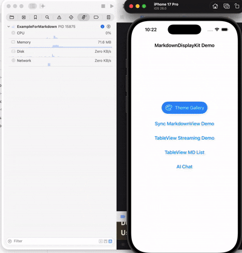

# MarkdownDisplayView

一个功能强大的 iOS Markdown 渲染组件，基于 TextKit 2 构建，提供流畅的渲染性能和丰富的自定义选项。同时也支持AI问答流式渲染md格式。

> 🚀 **MarkdownDisplayView 实现的流式渲染效果媲美 ChatGPT、Claude、豆包、DeepSeek、Grok 等主流 AI 终端的 iOS 客户端，并提供更丰富的自定义功能和配置选项。**

## 目录

- [效果展示](#效果展示)
- [Demo 效果](#demo-效果)
- [特性](#特性)
- [系统要求](#系统要求)
- [安装](#安装)
- [快速开始](#快速开始)
- [自定义配置](#自定义配置)
- [目录功能](#目录功能)
- [支持的 Markdown 语法](#支持的-markdown-语法)
- [完整示例](#完整示例)
- [性能优化](#性能优化)
- [高级用法](#高级用法)
- [自定义扩展](#自定义扩展)
- [故障排除](#故障排除)
- [更新日志](#更新日志)
- [贡献](#贡献)
- [许可证](#许可证)
- [作者](#作者)
- [致谢](#致谢)
- [联系方式](#联系方式)

## 效果展示

## Demo 效果

### 正常渲染（整页秒开）



### 流式渲染

- 模拟流式


- 与AI大模型对话

Config.local.json 结构如下：

```jsonc
// {
//   "host": "https://api.deepseek.com",
//   "path": "/chat/completions",
//   "apiKey": "",
//   "model": "deepseek-chat",
//   "systemPrompt": "You are a helpful assistant.",
//   "temperature": 0.7,
//   "stream": true,
//   "timeoutSeconds": 30
// }
```


## 特性

- 🚀 **高性能渲染** - 基于 TextKit 2，支持异步渲染和增量更新，流式渲染等，**秒开加载**，首屏渲染极速完成
- ⚡ **低 CPU 占用** - 流式模式下支持嵌套样式展示，iPhone 17 Pro 模拟器上 CPU 峰值 < 56%，平均仅 30%
- 🎨 **完整 Markdown 支持** - LaTeX协议公式、标题、列表、表格、代码块（支持横向滚动）、引用、图片等
- 🌈 **语法高亮** - 支持 20+ 种编程语言的代码高亮（Swift、Python、JavaScript 等）
- 📑 **自动目录** - 自动提取标题生成可交互目录
- 🎯 **高度可定制** - 字体、颜色、间距等全方位配置
- 🔌 **自定义扩展** - 支持自定义行内语法解析和代码块渲染器（如 Mermaid 图表）
- 🔗 **事件回调** - 链接点击、图片点击、目录导航
- 📱 **iOS 原生** - 使用 UIKit 和 TextKit 2 构建，性能优异
- 🌓 **深色模式** - 内置浅色和深色主题配置
- 📳 **震动反馈** - 流式输出时支持同步震动反馈，提升交互体验

## 系统要求

- iOS 15.0+(TextKit2 要求)
- Swift 5.9+
- Xcode 16.0+

## 安装

### Swift Package Manager

#### 方式一:Xcode 添加

1. 在 Xcode 中打开你的项目
2. 选择 `File` → `Add Package Dependencies...`
3. 输入仓库 URL:`https://github.com/zjc19891106/MarkdownDisplayView.git`
4. 选择版本并点击 `Add Package`

#### 方式二:Package.swift

在 `Package.swift` 中添加依赖:

```swift
dependencies: [
    .package(url: "https://github.com/zjc19891106/MarkdownDisplayView.git", from: "1.8.9")
]
```

`Package.swift` 会自动解析 `Kingfisher` `8.9.0` 起始版本，用于图片异步加载和缓存。

然后在 target 中添加:

```swift
.target(
    name: "YourTarget",
    dependencies: ["MarkdownDisplayView"]
)
```

### CocoaPods

在你的 `Podfile` 中添加以下内容:

```ruby

pod 'MarkdownDisplayKit', '~> 1.8.9'
```

然后运行:

```bash
pod install
```

**说明**：`MarkdownDisplayKit.podspec` 已声明 `AppleSwiftMDWrapper` 作为 Markdown 解析依赖，并声明 `Kingfisher (~> 8.9.0)` 作为图片加载依赖，执行 `pod install` 时会自动解析。

## 快速开始

### 基础用法

```swift
import UIKit
import MarkdownDisplayView

class ViewController: UIViewController {

    private let markdownView = ScrollableMarkdownViewTextKit()

    override func viewDidLoad() {
        super.viewDidLoad()

        // 添加到视图层级
        view.addSubview(markdownView)
        markdownView.translatesAutoresizingMaskIntoConstraints = false
        NSLayoutConstraint.activate([
            markdownView.topAnchor.constraint(equalTo: view.safeAreaLayoutGuide.topAnchor),
            markdownView.leadingAnchor.constraint(equalTo: view.leadingAnchor),
            markdownView.trailingAnchor.constraint(equalTo: view.trailingAnchor),
            markdownView.bottomAnchor.constraint(equalTo: view.bottomAnchor)
        ])

        // 设置 Markdown 内容
        markdownView.markdown = """
        # 欢迎使用 MarkdownDisplayView

        这是一个**功能强大**的 Markdown 渲染组件。

        ## 主要特性
        - 支持完整的 Markdown 语法
        - 代码语法高亮
        - 自动生成目录
        - 图片异步加载

        ### 代码示例

        ```swift
        let message = "Hello, World!"
        print(message)
        ```

        [访问 GitHub](https://github.com)
        """
    }
}
```

### 设置链接点击回调

```swift
markdownView.onLinkTap = { url in
    if UIApplication.shared.canOpenURL(url) {
        UIApplication.shared.open(url)
    }
}
```

### 设置图片点击回调

```swift
markdownView.onImageTap = { imageURL in
    print("图片被点击：\(imageURL)")
    // 可以在此处实现图片预览功能
}
```

## 自定义配置

### 使用预设主题

```swift
// 使用默认浅色主题
markdownView.configuration = .default

// 使用深色主题
markdownView.configuration = .dark
```

### 自定义配置

```swift
var config = MarkdownConfiguration.default

// 自定义字体
config.bodyFont = .systemFont(ofSize: 17)
config.h1Font = .systemFont(ofSize: 32, weight: .bold)
config.codeFont = .monospacedSystemFont(ofSize: 15, weight: .regular)

// 自定义颜色
config.textColor = .label
config.linkColor = .systemBlue
config.linkUnderlineEnabled = false    // 关闭链接下划线
config.codeBackgroundColor = .systemGray6
config.blockquoteTextColor = .secondaryLabel

// 自定义间距
config.paragraphSpacing = 16
config.headingSpacing = 20
config.imageMaxHeight = 500
config.lineSpacing = MarkdownLineSpacingConfiguration(
    body: 6,
    heading: 8,
    quote: 6,
    codeBlock: 4
)

// 应用配置
markdownView.configuration = config
```

### 完整配置选项

#### 字体配置

```swift
public var bodyFont: UIFont              // 正文字体
public var h1Font: UIFont                // H1 标题字体
public var h2Font: UIFont                // H2 标题字体
public var h3Font: UIFont                // H3 标题字体
public var h4Font: UIFont                // H4 标题字体
public var h5Font: UIFont                // H5 标题字体
public var h6Font: UIFont                // H6 标题字体
public var codeFont: UIFont              // 代码字体
public var blockquoteFont: UIFont        // 引用字体
```

#### 颜色配置

```swift
public var textColor: UIColor                          // 文本颜色
public var headingColor: UIColor                       // 标题颜色
public var linkColor: UIColor                          // 链接颜色
public var linkUnderlineEnabled: Bool                  // 链接是否显示下划线（默认 true）
public var codeTextColor: UIColor                      // 代码文本颜色
public var codeBackgroundColor: UIColor                // 代码背景色
public var blockquoteTextColor: UIColor                // 引用文本颜色
public var blockquoteBarColor: UIColor                 // 引用边框颜色
public var tableBorderColor: UIColor                   // 表格边框颜色
public var tableHeaderBackgroundColor: UIColor         // 表头背景色
public var tableRowBackgroundColor: UIColor            // 表格行背景色
public var tableAlternateRowBackgroundColor: UIColor   // 表格交替行背景色
public var horizontalRuleColor: UIColor                // 分隔线颜色
public var imagePlaceholderColor: UIColor              // 图片占位符颜色
public var footnoteColor: UIColor                      // 脚注颜色
public var tocTextColor: UIColor                       // 目录文字颜色
public var detailsSummaryTextColor: UIColor            // 折叠块标题文字颜色
```

#### 间距配置

```swift
public var paragraphSpacing: CGFloat       // 段落间距
public var headingSpacing: CGFloat         // 标题间距
public var listIndent: CGFloat             // 列表缩进
public var codeBlockPadding: CGFloat       // 代码块内边距
public var blockquoteIndent: CGFloat       // 引用缩进
public var imageMaxHeight: CGFloat         // 图片最大高度
public var imagePlaceholderHeight: CGFloat // 图片占位符高度
```

#### 行间距配置

```swift
public var lineSpacing: MarkdownLineSpacingConfiguration // 分角色行间距配置

public struct MarkdownLineSpacingConfiguration {
    public var body: CGFloat
    public var heading: CGFloat
    public var quote: CGFloat
    public var codeBlock: CGFloat
}
```

#### LaTeX 公式配置

```swift
public var latexFontSize: CGFloat          // LaTeX 公式字号（默认: 22）
public var latexAlignment: NSTextAlignment // LaTeX 公式对齐方式（.left, .center, .right）
public var latexBackgroundColor: UIColor   // LaTeX 公式背景颜色
public var latexPadding: CGFloat           // LaTeX 公式内边距（默认: 20）
```

#### 引用块配置

```swift
public var blockquoteBackgroundColor: UIColor  // 引用块背景颜色
public var blockquoteBarWidth: CGFloat         // 引用块左侧竖线宽度（默认: 4）
public var blockquoteContentSpacing: CGFloat   // 引用块内容间距（默认: 8）
public var blockquoteContentPadding: CGFloat   // 引用块内容内边距（默认: 12）
```

#### 表格配置

```swift
public var tableMinColumnWidth: CGFloat    // 表格最小列宽（默认: 80）
public var tableMaxColumnWidth: CGFloat    // 表格最大列宽（默认: 200）
public var tableRowHeight: CGFloat         // 表格行高（默认: 44）
public var tableCellPadding: CGFloat       // 表格单元格内边距（默认: 16）
public var tableSeparatorHeight: CGFloat   // 表格分隔线高度（默认: 1）
public var autoFixMalformedTables: Bool    // 自动修正常见异常表格文本（默认: true）
```

#### 列表配置

```swift
public var listItemSpacing: CGFloat        // 列表项间距（默认: 4）
public var listMarkerMinWidth: CGFloat     // 列表标记最小宽度（默认: 20）
public var listMarkerSpacing: CGFloat      // 列表标记与内容间距（默认: 4）
public var listTopPadding: CGFloat         // 整个列表顶部内边距（默认: 0）
public var listBottomPadding: CGFloat      // 整个列表底部内边距（默认: 0）
```

#### 折叠块（Details）配置

```swift
public var detailsSummaryFont: UIFont          // 折叠块标题字体
public var detailsSummaryTextColor: UIColor    // 折叠块标题文字颜色
public var detailsSummaryMinHeight: CGFloat    // 折叠块标题最小高度（默认: 40）
public var detailsContentPadding: CGFloat      // 折叠块内容内边距（默认: 12）
public var detailsSpacing: CGFloat             // 折叠块内部间距（默认: 8）
```

#### 代码高亮配置

```swift
public var syntaxColors: SyntaxHighlightColors      // 代码高亮颜色（浅色主题）
public var syntaxColorsDark: SyntaxHighlightColors  // 代码高亮颜色（深色主题）

// SyntaxHighlightColors 结构体
public struct SyntaxHighlightColors {
    public var keyword: UIColor       // 关键字颜色
    public var string: UIColor        // 字符串颜色
    public var number: UIColor        // 数字颜色
    public var comment: UIColor       // 注释颜色
    public var type: UIColor          // 类型颜色
    public var function: UIColor      // 函数颜色
    public var property: UIColor      // 属性颜色
    public var preprocessor: UIColor  // 预处理器颜色

    public static var xcode: SyntaxHighlightColors      // Xcode 浅色主题
    public static var xcodeDark: SyntaxHighlightColors  // Xcode 深色主题
}
```

#### 流式输出震动反馈配置

```swift
public var streamingHapticFeedbackStyle: StreamingHapticFeedbackStyle  // 震动反馈级别（默认: .none）
public var streamingHapticMinInterval: TimeInterval                    // 震动最小间隔时间（默认: 0.05 秒）

// StreamingHapticFeedbackStyle 枚举
public enum StreamingHapticFeedbackStyle {
    case none    // 不震动（默认）
    case light   // 轻微震动
    case medium  // 中等震动
    case heavy   // 强烈震动
    case soft    // 柔和震动 (iOS 13+)
    case rigid   // 刚性震动 (iOS 13+)
}

// 使用示例
var config = MarkdownConfiguration.default
config.streamingHapticFeedbackStyle = .light  // 启用轻微震动
config.streamingHapticMinInterval = 0.05      // 50ms 最小间隔
markdownView.configuration = config
```

## 目录功能

### 获取自动生成的目录

```swift
// Markdown 内容会自动解析标题生成目录
let tocItems = markdownView.tableOfContents

for item in tocItems {
    print("Level \(item.level): \(item.title)")
}
```

### 生成目录视图

```swift
// 自动生成可点击的目录视图
let tocView = markdownView.generateTOCView()

// 添加到界面
view.addSubview(tocView)
```

### 滚动到指定标题

```swift
// 点击目录项时滚动到对应位置
markdownView.onTOCItemTap = { item in
    markdownView.scrollToTOCItem(item)
}
```

## 支持的 Markdown 语法

### 标题

```markdown
# H1 一级标题
## H2 二级标题
### H3 三级标题
#### H4 四级标题
##### H5 五级标题
###### H6 六级标题
```

### 文本格式

```markdown
**粗体文本**
*斜体文本*
***粗斜体***
~~删除线~~
`行内代码`
```

### 列表

#### 无序列表

```markdown
- 项目 1
- 项目 2
  - 嵌套项目 2.1
  - 嵌套项目 2.2
```

#### 有序列表

```markdown
1. 第一项
2. 第二项
   1. 嵌套 2.1
   2. 嵌套 2.2
```

#### 任务列表

```markdown
- [x] 已完成任务
- [ ] 待完成任务
```

### 链接和图片

```markdown
[链接文本](https://example.com)

```

### 引用

```markdown
> 这是一段引用文本
> 可以包含多行
>> 支持嵌套引用
```

### 代码块

支持语法高亮的编程语言：

- Swift、Objective-C
- JavaScript、TypeScript、Python、Ruby
- Java、Kotlin、Go、Rust
- C、C++、Shell、SQL
- HTML、CSS、JSON、YAML
- 以及更多...

````markdown
```swift
func greet(name: String) -> String {
    return "Hello, \(name)!"
}
print(greet(name: "World"))
```
````

### 表格

```markdown
| 列1 | 列2 | 列3 |
|-----|-----|-----|
| A1  | B1  | C1  |
| A2  | B2  | C2  |
```

### 分隔线

```markdown
---
***
___
```

### 折叠区域（Details）

```html
<details>
<summary>点击展开</summary>

这里是折叠的内容
可以包含任何 Markdown 语法

</details>
```

### 脚注

```markdown
这是一段文本[^1]

[^1]: 这是脚注内容
```

## 完整示例

查看 `Example/ExampleForMarkdown` 目录下的完整示例项目，包含：

- 所有 Markdown 语法的渲染效果
- 自定义配置示例
- 视频、Mermaid 和 ECharts 自定义扩展示例
- 事件回调处理
- 性能测试

使用 CocoaPods 集成时，可查看包含相同自定义扩展的 [`CocoapodsMDExample`](CocoapodsMDExample/) 示例工程。

运行示例项目：

```bash
cd Example/ExampleForMarkdown
open ExampleForMarkdown.xcodeproj
```

## 性能优化

- **异步渲染** - Markdown 解析和渲染在后台队列执行，不阻塞主线程
- **增量更新** - 使用 Diff 算法，只更新变化的部分
- **图片懒加载** - 图片通过 Kingfisher 异步加载，并复用缓存
- **正则缓存** - 语法高亮正则表达式缓存复用
- **视图复用** - 高效的视图更新策略

## 高级用法

### 直接使用核心视图（无滚动）

```swift
let markdownView = MarkdownViewTextKit()
// 需要自己管理滚动容器
```

### 监听高度变化

```swift
let markdownView = MarkdownViewTextKit()

markdownView.onHeightChange = { newHeight in
    print("内容高度变化为: \(newHeight)")
    // 可用于动态调整容器高度
}
// 设置链接点击回调
markdownView.onLinkTap = { [weak self] url in
    // 处理链接点击
    if UIApplication.shared.canOpenURL(url) {
        UIApplication.shared.open(url)
    }
}
markdownView.onImageTap = { imageURL in
    // 内置 ImageView 会通过 Kingfisher 加载并缓存远程图片。
    // 如需图片预览，可使用 imageURL 打开自定义预览页。
}
markdownView.onTOCItemTap = { item in
    print("title:\(item.title), level:\(item.level), id:\(item.id)")
}
```

### 使用带滚动的视图（推荐）

```swift
let scrollableView = ScrollableMarkdownViewTextKit()
view.addSubview(scrollableMarkdownView)

scrollableMarkdownView.translatesAutoresizingMaskIntoConstraints = false

NSLayoutConstraint.activate([
    scrollableMarkdownView.topAnchor.constraint(
                equalTo: view.topAnchor, constant: 88),
    scrollableMarkdownView.leadingAnchor.constraint(equalTo: view.leadingAnchor),
    scrollableMarkdownView.trailingAnchor.constraint(equalTo: view.trailingAnchor),
    scrollableMarkdownView.bottomAnchor.constraint(equalTo: view.bottomAnchor),
])
// 内置 UIScrollView，自动处理滚动
scrollableMarkdownView.onLinkTap = { [weak self] url in
    // 处理链接点击
    if UIApplication.shared.canOpenURL(url) {
        UIApplication.shared.open(url)
    }
}
scrollableMarkdownView.onImageTap = { imageURL in
    // 内置 ImageView 会通过 Kingfisher 加载并缓存远程图片。
    // 如需图片预览，可使用 imageURL 打开自定义预览页。
}
scrollableMarkdownView.onTOCItemTap = { item in
    print("title:\(item.title), level:\(item.level), id:\(item.id)")
}
scrollableMarkdownView.markdown = sampleMarkdown
//返回目录
scrollableMarkdownView.backToTableOfContentsSection()
```

### 流式Readme展示

- 其他与上面滚动markdown view一致

```Swift
    //不一致是显示内容
    private func loadSampleMarkdown() {
        // 流式渲染（打字机效果）
        scrollableMarkdownView.startStreaming(
            sampleMarkdown,
            unit: .word,
            unitsPerChunk: 2,
            interval: 0.1,
        )
    }

    // 如果需要立即显示全部（比如用户点击跳过）
    @objc private func skipButtonTapped() {
        scrollableMarkdownView.markdownView.finishStreaming()
    }
```

### 智能流式渲染（LLM/网络 API）- 1.5.0 新增

适用于 LLM API（如 ChatGPT、Claude）等内容分块到达的实时流式场景：

```Swift
class ChatViewController: UIViewController {
    private let scrollableMarkdownView = ScrollableMarkdownViewTextKit()

    // 开启智能流式模式
    func startLLMStream() {
        scrollableMarkdownView.markdownView.beginRealStreaming()
    }

    // API 返回数据块时追加内容
    func onChunkReceived(_ chunk: String) {
        scrollableMarkdownView.markdownView.appendStreamData(chunk)
    }

    // 流式结束时调用
    func onStreamComplete() {
        scrollableMarkdownView.markdownView.endRealStreaming()
    }
}
```

用于 Table/Collection Cell 的 AI 对话流式推荐配置：

```Swift
var config = MarkdownConfiguration.default
config.typewriterTextMode = .append
config.typewriterHeightUpdateInterval = 20
config.streamMinModuleLength = 20
scrollableMarkdownView.markdownView.configuration = config
```

**核心特性**：
- **智能缓冲**：自动缓冲未完成的 Markdown 结构（未闭合的代码块、表格、LaTeX 公式）
- **纯文本识别**：`MarkdownStreamBuffer` 新增 `isPlainText()` 检测，用于识别非 Markdown 内容
- **纯文本更快输出**：对于没有 Markdown 标记的纯文本，模块允许在 `\n` 边界提交，不再必须等待 `\n\n`
- **Markdown 行为不变**：Markdown 内容仍按 `\n\n` 段落边界提交
- **增量渲染**：完整模块立即渲染，未完成内容继续缓冲等待
- **打字机效果**：渲染内容平滑的逐字显示动画

## 自定义扩展

MarkdownDisplayKit 支持自定义扩展，可以添加自己的 Markdown 语法和渲染。

### 示例位置与能力

自定义扩展实现位于示例工程中，不会随 `MarkdownDisplayView` 库 target 自动注册。两个 Demo 包含相同的实现：

- Swift Package 示例：[`Example/ExampleForMarkdown/ExampleForMarkdown`](Example/ExampleForMarkdown/ExampleForMarkdown/)
- CocoaPods 示例：[`CocoapodsMDExample/CocoapodsMDExample`](CocoapodsMDExample/CocoapodsMDExample/)
- 注册入口：[`AppDelegate.swift`](Example/ExampleForMarkdown/ExampleForMarkdown/AppDelegate.swift)
- 完整 Markdown 用法：[`MarkdownExampleViewController.swift`](Example/ExampleForMarkdown/ExampleForMarkdown/MarkdownExampleViewController.swift) 中的“十二、自定义样式测试”

| 示例 | 扩展方式 | 语法 | 当前能力 |
|------|----------|------|----------|
| 视频 | `MarkdownCustomParser` + `MarkdownCustomViewProvider` + `MarkdownCustomActionHandler` | `[video:文件名]` | 缩略图、时长、QuickLook 播放，支持 `.mov`、`.mp4`、`.m4v` |
| Mermaid | `MarkdownCodeBlockRenderer` | `` ```mermaid `` | 流程图、时序图、类图、状态图、甘特图、思维导图 |
| ECharts | `MarkdownCustomParser` + `MarkdownCustomViewProvider` | `<echarts height="320">JSON</echarts>` | 柱状图、饼图、折线图、散点图、堆叠面积图、K 线图、直方图、关系图、热力图 |

对应源码：

- [`MarkdownVideoExtension.swift`](Example/ExampleForMarkdown/ExampleForMarkdown/MarkdownVideoExtension.swift)
- [`MermaidRenderer.swift`](Example/ExampleForMarkdown/ExampleForMarkdown/MermaidRenderer.swift)
- [`MarkdownEChartsExtension.swift`](Example/ExampleForMarkdown/ExampleForMarkdown/MarkdownEChartsExtension.swift)

### 视频自定义扩展示例

在 `AppDelegate` 中注册视频扩展：

```swift
import MarkdownDisplayView

func application(_ application: UIApplication, didFinishLaunchingWithOptions launchOptions: [UIApplication.LaunchOptionsKey: Any]?) -> Bool {
    // 注册视频扩展
    MarkdownCustomExtensionManager.shared.registerVideoExtension()
    return true
}
```

**语法**: `[video:文件名]`

```markdown
## 视频演示

[video:myVideo]

支持格式: .mov, .mp4, .m4v
```

**功能特性**:
- 自动生成视频缩略图
- 显示视频时长
- 点击使用 QuickLook 播放

### 创建自定义扩展

实现三个协议来创建自定义扩展：

#### 1. 自定义解析器

```swift
class MentionParser: MarkdownCustomParser {
    let identifier = "mention"
    let pattern = "@([a-zA-Z0-9_]+)"  // 正则模式

    func parse(match: NSTextCheckingResult, in text: String) -> CustomElementData? {
        guard let range = Range(match.range(at: 1), in: text) else { return nil }
        let username = String(text[range])

        return CustomElementData(
            type: "mention",
            rawText: "@\(username)",
            payload: ["username": username]
        )
    }
}
```

#### 2. 自定义视图提供者

```swift
class MentionViewProvider: MarkdownCustomViewProvider {
    let supportedType = "mention"

    func createView(
        for data: CustomElementData,
        configuration: MarkdownConfiguration,
        containerWidth: CGFloat
    ) -> UIView {
        let label = UILabel()
        label.text = data.rawText
        label.textColor = .systemBlue
        label.font = configuration.bodyFont
        label.backgroundColor = UIColor.systemBlue.withAlphaComponent(0.1)
        label.layer.cornerRadius = 4
        label.sizeToFit()
        return label
    }

    func calculateSize(
        for data: CustomElementData,
        configuration: MarkdownConfiguration,
        containerWidth: CGFloat
    ) -> CGSize {
        let text = data.rawText as NSString
        let size = text.size(withAttributes: [.font: configuration.bodyFont])
        return CGSize(width: size.width + 8, height: size.height + 4)
    }
}
```

#### 3. 自定义事件处理器

```swift
class MentionActionHandler: MarkdownCustomActionHandler {
    let supportedType = "mention"

    func handleTap(data: CustomElementData, sourceView: UIView, presentingViewController: UIViewController?) {
        guard let username = data.payload["username"] else { return }
        print("跳转到用户主页: \(username)")
    }
}
```

#### 4. 注册扩展

```swift
let manager = MarkdownCustomExtensionManager.shared
manager.register(parser: MentionParser())
manager.register(viewProvider: MentionViewProvider())
manager.register(actionHandler: MentionActionHandler())
```

### 支持的自定义语法格式

| 扩展 | 语法 | 说明 |
|------|------|------|
| 视频 | `[video:文件名]` | 嵌入视频，支持 QuickLook 播放 |
| Mermaid | `` ```mermaid `` | 使用自定义代码块渲染器展示 Mermaid 图表 |
| ECharts | `<echarts height="320">JSON</echarts>` | 使用 HTML 风格自定义标签展示 ECharts 图表 |
| @提及* | `@username` | 用户提及（示例） |
| 表情* | `::emoji_name::` | 自定义表情（示例） |

视频、Mermaid 和 ECharts 实现在 Demo 中；`@提及` 和表情仅为协议用法示意，默认未包含实际实现。

### 代码块渲染器

除了行内语法扩展，还支持自定义代码块渲染器，用于渲染特定语言的代码块：

#### Mermaid 图表渲染器示例

```swift
public final class MermaidRenderer: MarkdownCodeBlockRenderer {
    public let supportedLanguage = "mermaid"

    public func renderCodeBlock(
        code: String,
        configuration: MarkdownConfiguration,
        containerWidth: CGFloat
    ) -> UIView {
        // 使用 WKWebView 渲染 Mermaid 图表
        let view = MermaidWebView(code: code, frame: ...)
        return view
    }

    public func calculateSize(
        code: String,
        configuration: MarkdownConfiguration,
        containerWidth: CGFloat
    ) -> CGSize {
        // 根据图表类型估算高度
        return CGSize(width: containerWidth - 32, height: estimatedHeight)
    }
}
```

#### 注册代码块渲染器

```swift
let manager = MarkdownCustomExtensionManager.shared
manager.register(codeBlockRenderer: MermaidRenderer())
```

**支持的图表类型**（通过 Mermaid.js）：
- 流程图 (flowchart/graph)
- 时序图 (sequenceDiagram)
- 类图 (classDiagram)
- 状态图 (stateDiagram)
- 甘特图 (gantt)
- 思维导图 (mindmap)

### ECharts 自定义标签示例

ECharts 示例使用 HTML 风格标签，但底层仍由 `MarkdownCustomParser` 识别，并通过 `MarkdownCustomViewProvider` 返回 `WKWebView`，不会开启通用 HTML 或任意 `<script>` 渲染。

在 `AppDelegate` 中注册：

```swift
MarkdownCustomExtensionManager.shared.registerEChartsExtension()
```

传入纯 JSON 格式的 ECharts `option`：

```markdown
<echarts height="320">
{
  "xAxis": { "type": "category", "data": ["周一", "周二", "周三"] },
  "yAxis": { "type": "value" },
  "series": [{ "type": "bar", "data": [120, 200, 150] }]
}
</echarts>
```

`height` 可选，默认 320pt，示例会将高度限制在 220～640pt。配置必须是 JSON 对象，不支持 JavaScript 函数；非法 JSON、脚本加载失败或渲染失败时会显示错误提示。当前 Demo 展示：

- 柱状图、饼图、折线图、散点图
- 堆叠面积图、K 线图、直方图
- 关系图、热力图

ECharts 和 Mermaid 示例通过 CDN 加载脚本，首次展示需要网络。如产品要求完全离线，可将固定版本的 JavaScript 文件加入 App Bundle，并在对应 Demo Renderer 中改为加载本地资源。

## 故障排除

### 1. 编译错误：找不到 UIKit

**问题**：在 macOS 上使用 `swift build` 编译失败

**解决方案**：此库仅支持 iOS 平台，必须在 Xcode 中针对 iOS 模拟器或设备进行构建

### 2. 图片不显示

**问题**：Markdown 中的图片无法显示

**原因**：

- 图片 URL 无效或无法访问
- 网络权限未配置

**解决方案**：

- 检查 Info.plist 中的网络权限配置
- 使用有效的图片 URL

### 3. Swift 并发警告

**问题**：出现 Sendable 相关警告

**解决方案**：库已使用 Swift 5.9 构建，避免严格并发检查

## 更新日志

### 1.9.8 (2026-08-04)

- 🚀 **带背压的智能流式管线** - SmartBuffer 现在增量释放安全的完整前缀，在后台串行解析模块，并按照单帧预算和 Typewriter 高低水位控制视图创建。即使解析速度超过播放速度，输入顺序、UI 顺序和最终 drain 完成条件仍保持确定性。
- ⚡ **基于 DisplayLink 的打字机调度** - 用 30 FPS `CADisplayLink` 时间线替换递归延迟 tick；标点延迟按 UTF-16 坐标预计算，待处理任务通过 O(1) FIFO head 消费，单帧追赶多个逻辑 step 时最多执行一次 reveal/布局回调。
- 📏 **增量高度缓存** - 流式高度根据 root 首次可见和文本高度 delta 增长，不再反复 fitting 整棵 `UIStackView`；相同宽度的 intrinsic size 读取直接命中缓存，高度通知统一合并，结构变化仍安全回退到完整校准。
- ✨ **稳定渲染，避免重复重绘闪烁** - TextKit 视图只在真实 bounds 变化时失效绘制；智能流式 TableView 更新串行合并，并保证结束时最终 flush，避免重叠的 self-sizing batch 反复重绘已展示内容。
- 🧱 **富文本块布局工作量有界** - 表格复用稳定布局几何，引用块按原子模块展示，只有真实宽度变化才触发布局测高失效；随着文档增长，表格、引用等富文本不再放大全文布局开销。
- 🔒 **模块与自定义扩展处理确定化** - 完整模块保持全局顺序和文档级标题 ID；fenced code 与 opaque 自定义块跨 chunk 时保持完整，自定义流式标签继续通过 `streamingBlockTagName` 显式启用。
- 🧹 **智能流式 API 与示例收敛** - 智能流式统一使用 `beginRealStreaming()`、`appendStreamData(_:)` 和 `endRealStreaming(completion:)`；删除预切块 `appendBlock` 路径及未使用的流式示例控件。
- 📊 **可选性能诊断与回归覆盖** - 新增通过 `MD_STREAM_PERF_LOG=1` / `MD_STREAM_PERF_ONLY=1` 开启的 `[MDPERF]` 聚合诊断，并覆盖 Unicode 标点、emoji 边界、FIFO 顺序、背压、重绘去重、高度缓存和最终 drain。合并基线已通过 68 项 iOS Simulator 测试以及 SwiftPM/CocoaPods 示例构建。

### 1.8.9 (2026-07-31)

- 🔒 **自定义扩展注册表线程安全** - Parser、ViewProvider、ActionHandler 与代码块 Renderer 的注册和读取现已加锁；第三方 Parser 回调在锁外执行，避免重入死锁。
- 🖼 **统一使用 Kingfisher 图片管线** - 删除重复的自研内存/磁盘图片缓存，图片加载、缓存命中和请求取消统一交由 Kingfisher 处理。
- ⚡ **LaTeX 公式真正单次解析** - 公式只解析一次，并由尺寸测量、Attachment 布局和视图创建共享同一个渲染结果，无需引入人为唯一 ID。
- 🧩 **Markdown 渲染器模块化拆分** - 将超长的 `MarkdownDisplayView.swift` 拆分为职责清晰的 `MarkdownViewTextKit` Extension 文件，同时保持公开 API 和既有渲染行为不变。

### 1.8.6 (2026-07-31)

- 🐛 **修复首次进入时折叠模块前大段留白** - 长有序列表不再在后续标题或 `<details>` 折叠模块前产生整屏空白；列表 wrapper 改为严格跟随真实内容高度，避免被 Auto Layout 任意纵向拉伸。
- 📏 **无需用户滑动即可同步延迟布局** - 离屏元素追加完成后，Markdown 最终高度会主动沿外层 ScrollView 的 `contentLayoutGuide` 和 `contentSize` 完成同步，不再依赖用户先滑动一次触发布局刷新。
- 📍 **追加式渲染保持当前滚动位置** - 延迟内容追加在当前视口下方时，不再把全部新增高度错误累加到 `contentOffset`，避免首次渲染期间发生错误跳转或被旧滚动范围截断。

### 1.8.5 (2026-07-30)

- ⚡ **流式缓存器增量扫描** - `MarkdownStreamBuffer.append()` 由每次全文重扫改为只扫描未提交尾部，消除 O(n²) 开销，长文本流式输入实测提速 1.6~3.8 倍；补齐 chunk 边界无关性差分测试锁定行为不变量。
- ⚡ **TextKit 2 增量排版与测高** - 打字机逐字追加不再整篇替换 attributedString，改为事务内增量修改；测高改用 `usageBoundsForTextContainer`，消除流式追加场景下的 O(n²) 卡顿。
- ⚡ **LaTeX 公式解析去重** - 单个公式的重复解析从 6 次降到 1 次，`LatexMathView` 内容未变时短路跳过。
- 🐛 **修复回归审查合入后的三处渲染缺陷** - 恢复容器宽度取值语义、修复 `draw(_:)` 脏矩形裁剪导致内容截断、离屏占位替换新增淡入过渡，避免闪烁。
- 🐛 **消除后台线程 UIKit 访问** - 统一在主线程读取容器宽度快照后再进入后台解析，规避潜在崩溃风险。
- 🐛 **流式自动滚动优化** - 增加用户接管判定与节流，用户上滑回看历史内容时不再被强制拽回底部。
- ⚡ **打字机看门狗改为常驻 Timer** - 避免每步重建 Timer，且在 `.common` RunLoop mode 下滚动期间仍可正常兜底。
- ⚡ **正则缓存覆盖补全** - 详情块与代码高亮的正则匹配统一走已有的 `cachedRegex`。
- 🧹 **代码清理** - 删除全仓库零调用的增量解析死代码；251 处调试日志加 `#if DEBUG` 守卫，降低 Release 包的日志开销。
- ✨ **AI 对话示例增强** - CocoaPods/SPM 示例新增聊天历史记录能力，并优化交互细节。

### 1.8.1 (2026-07-15)

- 📏 **Append 打字机高度稳定性** - 字符揭示与高度重测解耦，仅在高度真正变化时触发布局回调，减少流式播放时的行高抖动。
- 🧱 **不再预暴露最终空白高度** - Append 模式在开始打字前会丢弃预计算的最终高度，避免 Cell 先闪出大块空白，高度只随可见文本增长。
- 🔒 **播放期高度下限** - Append 打字机播放期间禁止因临时宽度修正而回缩高度，避免气泡上下跳动；播放完成或引擎 stop 后释放下限，宽屏重排仍可正常收敛。
- 🧪 **流式布局测试** - 新增字符揭示/高度解耦、播放前高度重置、完成/停止后释放高度下限等覆盖用例。

### 1.8.0 (2026-07-14)

- 🌊 **真流式渲染稳定性修复** - 开始真流式输出时会取消并失效尚未完成的普通渲染任务，避免旧解析结果回写并覆盖正在运行的打字机界面。
- 🧱 **原子块级内容整块显示** - 表格、代码块、图片、LaTeX、详情块、分隔线和自定义视图会按最终高度整块显示，不再从临时 `1pt` 占位高度逐步撑开。
- 📜 **聊天自动跟随与行高修复** - SPM 与 CocoaPods 的 AI 聊天示例会合并行高更新，在布局变化后持续跟随流式消息，并在用户浏览历史消息时暂停自动滚动。
- ✨ **减少流式 Cell 闪烁** - 离屏增量不再反复 reload Cell，复用后的流式 Cell 会从累计内容继续输出，并等待打字机队列真正播放完毕后再切换为静态展示。

### 1.7.8 (2026-05-26)

- 🖼 **Kingfisher 图片加载** - `ImageView.swift` 中的 Markdown 图片加载与缓存切换为 Kingfisher 8.9.0。
- 📦 **依赖对齐** - `Package.swift` 与 `MarkdownDisplayKit.podspec` 同步声明 Kingfisher，SPM 和 CocoaPods 使用同一个图片库。
- 🧪 **示例更新** - `ExampleForMarkdown` 和 `CocoapodsMDExample` 的图片视图已更新为 Kingfisher 加载实现。

### 1.7.5 (2026-05-15)

- 🚀 **预渲染内容渲染入口** - 新增 `MarkdownRenderer.prepare(_:)` 与 `MarkdownViewTextKit.setPreparedContent(_:)`，业务侧可提前解析长 Markdown，并复用生成好的渲染元素。
- 📏 **预计算高度快速路径** - 预渲染结果携带元素高度估算，在宽度已知时文本/标题视图可跳过首次 TextKit 高度计算。
- 🧪 **历史长 Markdown 示例优化** - `CocoapodsMDExample` 中的历史消息页面改为后台预渲染长 Markdown，并使用缓存行高，降低首次滑动卡顿。
- 🐛 **历史消息空白修复** - 移除过大的初始行高占位，并修正高度回调设置顺序，确保真实测量高度能正确替换估算高度。

### 1.7.4 (2026-04-10)

- 📏 **高度测量稳定性修复** - 加固 `notifyHeightChange`：增加宽度兜底、基于 frame 的高度回退，以及临时 `0` 高度抑制，避免初始布局或快速更新时出现 `0 ↔ 实际高度` 来回跳变。
- 🌊 **段落级流式切分回退** - 当标题数量不足以用于模块切分时，真流式模式现在会按段落边界输出单标题或无标题 Markdown，同时跳过 fenced code block 内部的空段切分。
- 📐 **整个列表头尾内边距** - 新增 `listTopPadding` 和 `listBottomPadding`，支持为整个列表 wrapper 配置顶部/底部间距，而不改变每个列表项自身布局。

### 1.7.2 (2026-04-04)

- ➕ **新增 `isPlainText()` 检测** - 在 `MarkdownStreamBuffer` 中新增 `isPlainText()`，用于识别非 Markdown 内容。
- ⚡ **纯文本流式输出加速** - 对于没有 Markdown 标记的纯文本，模块可在 `\n` 边界提交，不再强制等待 `\n\n`，以更快触发打字机输出。
- ✅ **Markdown 输出行为保持不变** - Markdown 内容仍然等待 `\n\n` 段落边界后提交。

### 1.7.1 (2026-04-03)

- 🐛 **有序列表高度一致性修复** - 修复部分 Stack/ReUse 场景下“第一个有序列表项高度被异常拉高、与后续项不一致”的问题。
- 🧱 **列表布局约束加固** - 调整列表外层约束（`bottom <=`）并增强垂直方向 hugging/compression 优先级，避免额外高度被首项吸收。
- 🧹 **列表内容归一化清理** - 增加列表不可见文本节点清理（首尾换行、零宽字符、控制/空白字符），避免“幽灵高度”撑开列表项。

### 1.7.0 (2026-04-03)

- 📊 **Markdown 表格列对齐支持** - 新增 `:---`、`:---:`、`---:` 对齐语法解析，并按列应用左/中/右对齐。
- 🛠 **异常表格自动修复** - 新增 `autoFixMalformedTables`（默认 `true`），自动修正常见异常输出（孤立 `|`、表格块内误空行）。
- ✍️ **行间距配置化** - 新增 `lineSpacing` 配置（`body`、`heading`、`quote`、`codeBlock`），替代固定行间距常量。
- 🔗 **表格链接点击回调** - 表格 cell 保持 `UILabel`（滚动性能更优），通过 cell 点击识别链接并复用 `onLinkTap` 回调链路。
- 🐛 **触摸路由修复** - 修复外层 TextKit 点击手势可能抢占表格附件触摸，导致表格链接点击不生效的问题。
- ⚠️ **配置项收敛** - 移除表格文本对齐覆盖配置项；表格文本对齐以 Markdown 语法为准（默认左对齐）。

### 1.6.9 (2026-03-17)

- 🔗 **链接下划线可配置** - 新增 `linkUnderlineEnabled` 配置项，支持控制链接是否显示下划线
  - `MarkdownConfiguration` 新增属性 `linkUnderlineEnabled: Bool`（默认值 `true`）
  - 同时作用于 Markdown 行内链接（`[文字](url)`）和目录导航链接
  - **根因修复**：实现 `NSTextLayoutManagerDelegate.renderingAttributesForLink(_:at:defaultAttributes:)` 代理方法，正确拦截 TextKit 2 内置链接渲染管线——此前该管线会完全忽略 `NSAttributedString` 中设置的 `underlineStyle` 属性

### 1.6.8 (2026-02-06)

- 📜 **代码块横向滚动** - 代码块现支持横向滚动，可查看完整的长代码行
  - 采用 `NSTextAttachmentViewProvider` 模式实现，与 LaTeX 公式和表格的渲染架构保持一致
  - 新增 `CodeBlockAttachment` 和 `CodeBlockAttachmentViewProvider` 类处理代码块渲染
  - 代码文本不再换行，用户可通过横向滚动查看完整代码内容
  - 保留原有的语法高亮、背景色和圆角样式

### 1.6.2 (2026-02-05)

- 📳 **震动反馈时机优化** - 震动反馈现与 TypewriterEngine 输出节奏精确同步
  - 文字震动：仅在 `revealCharacter` 实际显示新字符时触发
  - 块级震动：在块级元素（图片、LaTeX 等）动画完成时触发
  - 移除容器视图（`.show`）和小元素（`.label`）的不必要震动
  - 震动不再在数据到达时触发，而是在内容实际显示时触发

### 1.6.1 (2026-02-02)

- 📳 **流式输出震动反馈** - 新增流式输出时的震动反馈支持，提升用户交互体验
  - 新增 `StreamingHapticFeedbackStyle` 枚举，支持多种震动级别：`.none`、`.light`、`.medium`、`.heavy`、`.soft`、`.rigid`
  - 新增配置项 `streamingHapticFeedbackStyle`（震动反馈强度）和 `streamingHapticMinInterval`（震动最小间隔）
  - 智能流式（`appendStreamData`）和假流式（`startStreaming`）模式均支持

### 1.6.0 (2026-01-30)

- 🎨 **全面配置项支持** - 新增所有 Markdown 元素的详细配置：
  - **LaTeX 公式**：`latexFontSize`、`latexAlignment`（居左/居中/居右）、`latexBackgroundColor`、`latexPadding`
  - **引用块**：`blockquoteBackgroundColor`、`blockquoteBarWidth`、`blockquoteContentSpacing`、`blockquoteContentPadding`
  - **表格**：`tableMinColumnWidth`、`tableMaxColumnWidth`、`tableRowHeight`、`tableCellPadding`、`tableSeparatorHeight`
  - **列表**：`listItemSpacing`、`listMarkerMinWidth`、`listMarkerSpacing`
  - **折叠块**：`detailsSummaryFont`、`detailsSummaryTextColor`、`detailsSummaryMinHeight`、`detailsContentPadding`、`detailsSpacing`
  - **代码高亮**：`syntaxColors`、`syntaxColorsDark`，支持 `SyntaxHighlightColors` 结构体（关键字、字符串、数字、注释、类型、函数、属性、预处理器）
  - **目录**：`tocTextColor`
- 🐛 **Bug 修复** - `tableRowBackgroundColor` 现已正确应用于表格行
- 📝 **文档更新** - 更新 README 完善所有配置选项文档

### 1.5.9 (2026-01-26)

- 🚀 **打字机追加模式** - 新增 `.append` 模式，并对高度更新节流，减少 Cell 流式输出时的布局跳变
- ⚙️ **流式配置项** - 提供 `typewriterTextMode`、`typewriterHeightUpdateInterval`、`streamMinModuleLength`
- 🧹 **内存清理** - 增加缓存清理与 Mermaid WebView 释放逻辑，降低页面退出后的驻留内存
- 🧪 **示例更新** - AI 对话流式 LaTeX 规范化更安全（忽略代码区域），并给出推荐配置

### 1.5.8 (2026-01-23)

- 📝 **文档更新** - 更新 README 内容
- 🐛 **SPM 修复** - 修复 Swift Package Manager 示例在模拟器上的编译问题

### 1.5.2 (2026-01-08)

- 🐛 **崩溃修复** - 串行化 `swift-markdown` 解析，避免并发渲染触发 `cmark_parser_attach_syntax_extension` 崩溃
- 🧹 **复用安全** - 新增 `resetForReuse()` 清理内部缓存与状态，适配 `UITableViewCell` 复用场景
- 🧪 **示例更新** - 增加崩溃复现页面与表格场景的逐条插入演示

### 1.5.1 (2026-01-07)

- 🐛 **Bug 修复** - 修复流式渲染处理 Unicode 字符（emoji、中日韩字符）时可能崩溃的问题
  - `MarkdownStreamBuffer.extractModule`: 使用 `limitedBy` 安全获取字符串索引，防止越界崩溃
  - `TypewriterEngine.calculateDelay`: 使用安全索引获取字符，防止计算特殊字符延迟时崩溃

### 1.5.0 (2026-01-04)

- 🚀 **真流式渲染支持** - 新增 `MarkdownStreamBuffer` 智能流式缓冲器，支持网络/LLM API 实时流式渲染
  - 智能模块检测：自动识别完整的 Markdown 块（标题、代码块、表格、LaTeX 公式）
  - 未闭合结构处理：等待闭合标签后再渲染（如未闭合的 ``` 或 $$）
  - 增量渲染：完整模块立即渲染，未完成内容继续缓冲
- 💫 **智能等待动画** - 真流式模式下，当 TypewriterEngine 队列为空且网络数据未到达时，自动显示等待动画
- 🏗️ **代码重构** - 将 `MarkdownTextViewTK2`、`MarkdownStreamBuffer` 和 `TypewriterEngine` 提取到独立文件，提升代码可维护性
- 🐛 **流式修复** - 多项真流式模式稳定性和渲染问题修复

### 1.4.1 (2026-01-02)

- 🐛 **Bug 修复** - 修复真流式模式下代码块分块到达时无法正确渲染的问题

### 1.4.0 (2025-12-31)

- 🚀 **秒开优化** - 大幅优化加载速度，首屏渲染极速完成
- ⚡ **CPU 优化** - 流式模式下增加嵌套样式展示后，CPU 使用率大幅降低（iPhone 17 Pro 模拟器峰值 < 56%，平均 30%）
- 🔌 **自定义扩展增强** - 新增代码块渲染器协议 `MarkdownCodeBlockRenderer`，支持 Mermaid 等图表渲染
- 🎨 **Mermaid 支持** - 示例项目新增 Mermaid 图表渲染器，支持流程图、思维导图等

### 1.0.0 (2025-12-15)

- 🎉 首次发布
- ✅ 完整 Markdown 语法支持
- ✅ 20+ 种语言代码高亮
- ✅ 自动目录生成
- ✅ 深色模式支持
- ✅ 高性能异步渲染

## 贡献

欢迎提交 Issue 和 Pull Request！

在提交 PR 前，请确保：

- 代码通过编译
- 遵循现有代码风格
- 添加必要的测试

## 许可证

本项目采用 MIT 许可证 - 详见 [LICENSE](LICENSE) 文件。

## 作者

MarkdownDisplayView 由 [@zjc19891106](https://github.com/zjc19891106) 创建和维护。
如果觉得这个库帮到你的忙节省了你的时间，可以考虑支持一下我，感谢所有打赏支持我的朋友们，这里就不一一点名了！您的支持有助于作者的长期维护与改进。

- 支持作者
- WeChat
  
- AliPay
  
- Paypal
  

## 致谢

- [swift-markdown](https://github.com/swiftlang/swift-markdown) - Markdown 解析库
- [Kingfisher](https://github.com/onevcat/Kingfisher) - 图片加载与缓存库
- [KaTeX](https://github.com/KaTeX/KaTeX) - 数学公式渲染字体
- Apple TextKit 2 - 高性能文本渲染框架
- Gemini3 Pro&Claude&Grok&GPT
- 所有贡献者和使用者
- 所有给我提供建议和反馈的朋友们


## 联系方式

如有问题或建议，请通过以下方式联系：

- 提交 [GitHub Issue](https://github.com/zjc19891106/MarkdownDisplayView/issues)
- 发送邮件至：984065974@qq.com 或 luomobancheng@gmail.com

- QQ 群 
 

- 微信群


- Telegram


- Discord


---

**如果觉得这个项目有帮助，请给个 Star ⭐️ 支持一下！**
